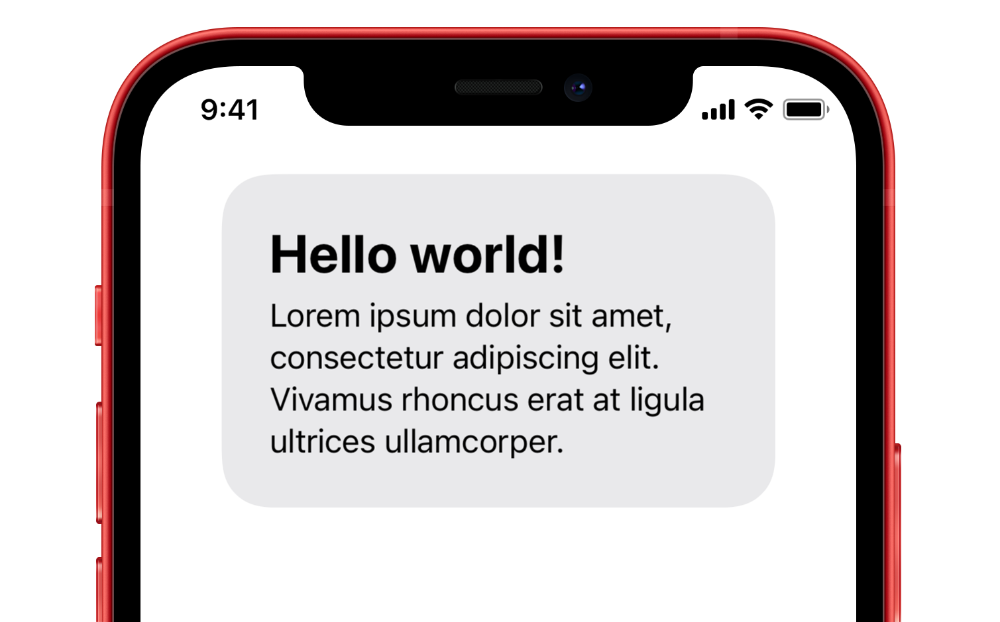

# TOBorderView

<p align="center">

</p>

[](https://github.com/TimOliver/TOBorderView/actions?query=workflow%3ACI)
[](http://cocoadocs.org/docsets/TOBorderView)
[](https://raw.githubusercontent.com/TimOliver/TOBorderView/master/LICENSE)
[](http://cocoadocs.org/docsets/TOBorderView)


`TOBorderView` is a very basic, but high performance container UI component that wraps custom view content inside a colored rectangle with rounded corners. It automatically handles correctly insetting the content, as well as managing the internal view hierarchy in order to guarantee maximum performance.

Starting with iOS 11, and to a much great extent on Big Sur, the design language on Apple's platforms has become such that separating content by enclosing it in rounded rectangles has become preferable to using high contrast hairline separators.

As this is such a common view to see in applications, it made sense to create one high quality reusable component, than simply recreating it whenever it is needed.

## Features

* Encloses custom view content in a customizable rounded rectangle background.
* Provides an internal content view adjusted by the insets, making it much easier to insert and configure the frames of view content.
* Internally manages the layering of the content and the background views to ensure that off-screen render passes don't occur as much as possible, ensuring best possible performance.
* Provides convenience properties and methods for configuring view content to have adjusted corner radius values that align with the outer radius.
* The rounded rectangle background view can potentially be made translucent using `UIVisualEffectView`.

## System Requirements
iOS 13.0 and above.

## Installation

**As a CocoaPods Dependency**

Add the following to your Podfile:
```
pod 'TOBorderView'
```

**Swift Package Manager**

Will be coming as soon as I get the time! If you can't wait, please consider filing a PR.

**Manual Installation**

Copy the folder `TOBorderView` to your Xcode project.

`TOBorderView` is an Objective-C project, but it has been written to work properly in Swift as well. If you are using it in a Swift project, don't forget to include it in your Objective-C bridging header.

## Examples

```objc
// Make an image view as some kind of content
UIImageView *imageView = [[UIImageView alloc] initWithFrame:(CGRect){0,0,100,135}];

// Make a border view
TOBorderView *borderView = [[TOBorderView alloc] init];

// Set the insets to be really tight around the imaga
[borderView setAllContentInsets: 10.0f];

// Add the image view to the border view
[borderView addSubview: imageView];

// Configure the image view to have matching corner radius
[borderView applyContentCornerRadiusToView: imageView];

// Size the border view to wrap around the image view
[borderView sizeToFit];

```

## Credits
`TOBorderView` was originally created by [Tim Oliver](http://twitter.com/TimOliverAU) as a component for iComics 2, an upcoming comic reader app for iOS.

iOS Device mockups used in the screenshot created by [Pixeden](http://www.pixeden.com).

## License
`TOBorderView` is licensed under the MIT License, please see the [LICENSE](LICENSE) file.
